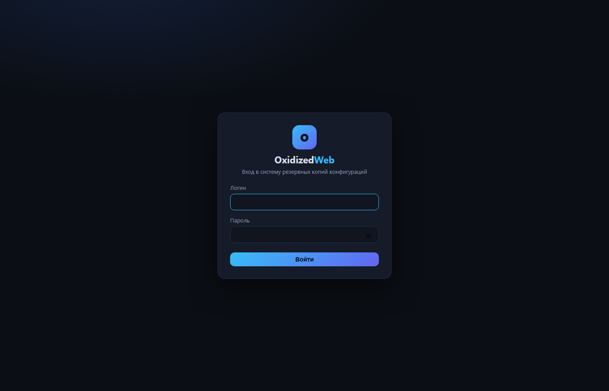
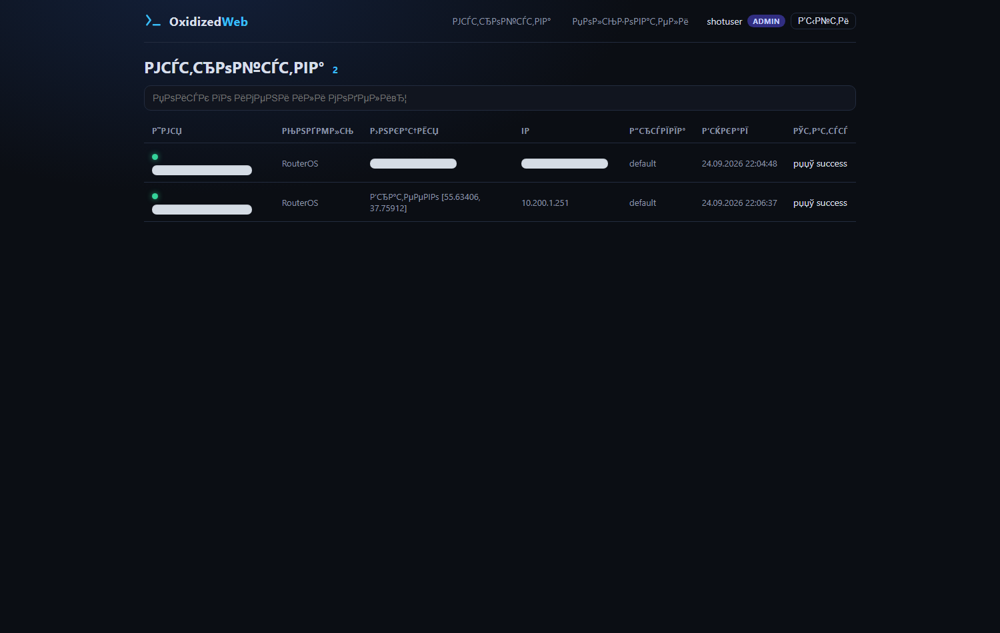

# OxidizedWeb — LibreNMS + Oxidized

Web-интерфейс поверх **Oxidized** (резервное копирование конфигураций сетевых устройств)
с данными из **LibreNMS** (инвентаризация, имена, локации) плюс **полный one-shot
интерактивный установщик** всего стека на голый Linux.

## Скриншоты

Страница входа (`/login`):



Дашборд устройств (`/`) — Имя / Локация / IP замаскированы (модель, время бэкапа и статус видны):



## Состав репозитория

| Путь | Назначение |
|------|------------|
| `deploy/install.sh` | **One-shot интерактивный мастер**: ставит весь стек (MariaDB, LibreNMS, Oxidized, nginx, php-fpm, oxidized-web) на голый Debian 12 / Ubuntu 22.04 / 24.04, опрашивая обо всех параметрах |
| `deploy/templates/nginx-librenms.conf` | Эталонный виртуальный хост nginx для LibreNMS (используется шаблонами установщика) |
| `deploy/templates/nginx-oxidized-web.conf` | Эталонный виртуальный хост nginx для oxidized-web |
| `config.example.php` | Шаблон `config.php` oxidized-web. **Скопируйте в `config.php`** и укажите пароль. Реальный `config.php` в git не попадает (`.gitignore`) |
| `src/oxidized.php` | Ядро интеграции: REST-клиент Oxidized (`/nodes`, `/node/fetch`, версии, diff), helpers `oxz_sysname()` и `oxz_location()` |
| `public/index.php` | Front-controller: роутер, таблица устройств (`/`), `/config`, `/versions`, `/version`, `/diff`, `/users`, `/login` |
| `apk/OxidizedMobile-v1.3.apk` | Готовое мобильное приложение OxidizedMobile (Android APK, v1.3) |
| `.gitignore` | Исключает `config.php`, `.env`, БД (`data/*.db`), keystore'ы, кэши и локальные файлы |

## Как это устроено (архитектура)

```
LibreNMS ──(inventory: MySQL devices/locations)──► OxidizedWeb (PHP, port 8889)
    │                                                   │
    │ (built-in Oxidized integration)                   │ pulls REST
    ▼                                                   ▼
 Oxidized ────────────────(REST API :8888)───────────► /\nodes.json, /node/fetch
    │
    ▼
 configs backup (git storage)
```

1. **LibreNMS** — система мониторинга/инвентаризации. В её MySQL живут таблицы
   `devices` (IP, hostname, sysName, `location_id`) и `locations` (названия локаций).
2. **Oxidized** — демон резервного копирования конфигов. LibreNMS сама передаёт ему
   список устройств (встроенная интеграция), Oxidized хранит конфиги в git.
3. **OxidizedWeb** — кастомный PHP-фронтенд: **читает** Oxidized по REST API и
   **обогащает** список устройств данными из БД LibreNMS (константы `OX_LX_*`).

## 🔧 Установка всего стека одной командой (интерактивный мастер)

Скрипт `deploy/install.sh` ставит **всё с нуля** на голый сервер и в процессе
**задаёт вопросы по каждому параметру**. Нажатие Enter = значение по умолчанию,
пустой ввод для пароля = автоматическая генерация.

### Шаг 1. Подготовка сервера

```bash
# Свежий Debian 12 / Ubuntu 22.04 / 24.04 (amd64). От root:
apt-get update && apt-get install -y git curl
git clone https://github.com/Brateevo/oxidized-web.git /opt/oxidized-web
cd /opt/oxidized-web
```

### Шаг 2. Запуск

```bash
sudo bash deploy/install.sh
```

### Шаг 3. Какие вопросы задаёт мастер (и что вставляет по ответам)

| Вопрос (промпт) | По умолчанию | Куда вставляется |
|---|---|---|
| Имя БД LibreNMS | `librenms` | CREATE DATABASE, `.env`, `config.php` |
| MySQL-логин для LibreNMS | `librenms` | CREATE USER + GRANT ALL, `.env` |
| **Пароль MySQL LibreNMS** | случайный | GRANT, `.env` |
| MySQL-аккаунт oxidized-web (read-only) | `oxidized_web` | CREATE USER + GRANT SELECT, `config.php` |
| **Пароль oxidized-web (MySQL)** | случайный | GRANT, `config.php` |
| **Пароль админа LibreNMS** | случайный | `php artisan user:add --role=admin` |
| Логин админа LibreNMS | `admin` | `php artisan user:add` |
| Email админа LibreNMS | `admin@localhost` | `php artisan user:add` |
| **Пароль админа oxidized-web** | случайный | SQLite `users` (при первом запуске) |
| Логин админа oxidized-web | `admin` | SQLite `users` |
| IP/домен LibreNMS (nginx) | первый IP хоста | `listen`, `server_name`, `.env APP_URL` |
| Порт LibreNMS nginx | `80` | `listen`, APP_URL |
| IP/домен oxidized-web | как у LibreNMS | `listen`, `server_name` |
| Порт oxidized-web nginx | `8889` | `listen` |
| Oxidized REST host (bind) | `127.0.0.1` | `/etc/oxidized/config` (`rest:`) |
| Oxidized REST порт | `8888` | `/etc/oxidized/config`, `config.php` LibreNMS |
| Группа Oxidized по умолчанию | `default` | `config.php` LibreNMS |
| FQDN для исходящих ссылок (base_url) | `http://<IP>` | `.env APP_URL` (порт подставляется автоматически) |

> Все ответы сохраняются в `/root/oxidized-web-deploy.secrets` (`chmod 600`) —
> пароли не печатаются в лог и не зашиты в репозиторий.

### Шаг 4. Что делает скрипт по фазам

1. **Phase 0 — база**: `apt-get` ставит nginx, MariaDB, Redis, PHP-FPM (+ модули
   `pdo_mysql`, `curl`, `sqlite3`, `mbstring` и др.), rrdtool, snmp, composer, ruby, git.
   PHP-версия определяется автоматически.
2. **Phase 1 — MariaDB**: создаёт БД `librenms`, пользователя `librenms` (`ALL`) и
   read-only `oxidized_web` (`SELECT` на `devices` и `locations`, для хостов
   `127.0.0.1` / `localhost` / `%`).
3. **Phase 2 — LibreNMS**: `git clone` в `/opt/librenms`, `composer install`,
   `.env` с ответами мастера, `artisan migrate`, cron (poller/discovery/alerts),
   создание первого админа, включение интеграции Oxidized и REST API в `config.php`.
4. **Phase 3 — nginx + php-fpm**: пул `librenms` (сокет `/run/php-fpm-librenms.sock`)
   и виртуальный хост из шаблона с IP/портом из мастера.
5. **Phase 4 — Oxidized**: `gem install oxidized`, `/etc/oxidized/config`
   (REST со значениями мастера, source = `http://<IP>:<port>/api/v0/oxidized`),
   systemd-юнит `oxidized.service`.
6. **Phase 5 — oxidized-web**: копирует `public/` и `src/` в `/opt/oxidized-web`,
   генерирует реальный `config.php`, пул `oxidized` (сокет
   `/run/php-fpm-oxidized.sock`), nginx-хост на порту 8889.
7. **Phase 6 — старт + админы**: рестарт php-fpm/nginx, бутстрап первого админа
   oxidized-web (только если таблица пуста, повторные запуски не дублируют).
8. **Verify**: статусы служб (`nginx`, `php-fpm`, `mariadb`, `redis`, `oxidized`),
   HTTP-коды обоих сайтов, итоговое резюме с адресами.

### Шаг 5. После установки (чек-лист)

- [ ] Открыть `http://<IP>` — зайти в LibreNMS администратором (логин из мастера),
      проверить, что установка прошла полностью (Веб: `Settings` → `General` → `Overview`).
- [ ] Добавить устройства в LibreNMS (`Devices → Add Device`).
- [ ] Oxidized подхватит их автоматически через `/api/v0/oxidized` и начнёт бэкап.
- [ ] Открыть `http://<IP>:8889` — в таблице устройств видны имя, модель, **Локация**, IP,
      статус и время бэкапа (см. [Скриншоты](#скриншоты)).
- [ ] Вписать рабочие SSH/ENABLE доступы устройств в `/etc/oxidized/config` (верхний блок
      `username/password/vars.enable`) и перезапустить Oxidized.
- [ ] Если хост доступен извне — настроить TLS (nginx) и ограничить порт 8889.

## Ручная установка (если стек уже стоит)

Если LibreNMS + Oxidized уже есть — развернуть только oxidized-web:

```bash
# 1) скопировать приложение
cp -r public src /opt/oxidized-web/
mkdir -p /opt/oxidized-web/data/sessions

# 2) создать конфиг из примера
cp config.example.php /opt/oxidized-web/config.php
#    и вписать реальный OX_LX_PASS

# 3) права БД (read-only учётка приложения)
mysql -e "GRANT SELECT ON librenms.devices   TO 'oxidized_web'@'127.0.0.1';"
mysql -e "GRANT SELECT ON librenms.locations TO 'oxidized_web'@'127.0.0.1';"
mysql -e "GRANT SELECT ON librenms.*         TO 'oxidized_web'@'127.0.0.1';"
mysql -e "FLUSH PRIVILEGES;"
#    + аналогичные GRANT для 'oxidized_web'@'localhost' и '%', если приложение
#    ходит к MySQL через них

# 4) php-fpm: пул oxidized (см. install.sh Phase 5), nginx: root → public/, порт 8889
# 5) первый админ создаётся при первом открытии через /setup или вручную (см. install.sh)
php -l src/oxidized.php && php -l public/index.php
```

> **Симптом отсутствия GRANT** на `locations`: колонка «Локация» у всех устройств пустая
> (`SELECT command denied` → fallback `-`).

## Пошагово: как работает интеграция

### Oxidized (демон + REST)
- Демон слушает REST API (`rest: <host>:<port>` из мастера, по умолчанию `127.0.0.1:8888`).
- Эндпоинты, используемые приложением:
  - `GET /nodes.json` — список узлов `[name, model, group, status, ip, time]` (`ox_nodes()`);
  - `GET /node/fetch/<name>` — текущий конфиг (`ox_fetch_config()`);
  - `GET /node/version.json?node_full=<name>` — история версий (`ox_versions()`);
  - `GET /node/version/view?node=<name>&oid=<oid>` — содержимое версии (`ox_version_view()`).
- Diff между версиями считается локально LCS-алгоритмом (`render_unified_diff()`).

### LibreNMS → обогащение данных
- Подключение к MySQL LibreNMS по `OX_LX_*` из `config.php`.
- `oxz_sysname(string $ip): string` — `sysName` устройства, fallback — hostname:
  ```sql
  SELECT COALESCE(NULLIF(sysName, ''), hostname)
  FROM devices WHERE ip = ? OR hostname = ? LIMIT 1
  ```
- `oxz_location(string $ip): string` — локация через `devices.location_id → locations.id`:
  ```sql
  SELECT COALESCE(NULLIF(l.location, ''), '-')
  FROM devices d
  LEFT JOIN locations l ON l.id = d.location_id
  WHERE d.ip = ? OR d.hostname = ? LIMIT 1
  ```
- Любой сбой БД **не валит страницу**: функции глотают `Throwable` и возвращают
  fallback (`$ip` / `'-'`).

### Фронтенд (public/index.php)
- Front-controller: единственный `index.php` разбирает путь и рендерит страницы.
- Главная (`GET /`): Имя, Модель, **Локация**, IP, Группа, время бэкапа, статус.
  Для не-админов список фильтруется по `user_devices` (`filter_nodes_by_user()`).
- Страницы: `/config`, `/versions`, `/version`, `/diff`, `/users`, `/login`, `/logout`.
- Защита: авторизация (`require_auth()`), CSRF (`csrf_check()`), экранирование через `e()`.

## Мобильное приложение

`apk/OxidizedMobile-v1.3.apk` — собранный Android APK (веб-представление). Исходники
мобильной части (`OxidizedMobile`, `OxidizedPWA`) в этом репозитории не хранятся —
залит только готовый артефакт.

## Требования и ограничения

- Целевой хост: Debian 12 / Ubuntu 22.04 / Ubuntu 24.04 (amd64), `apt-get`, root.
- PHP 8.4+ с расширениями `pdo_mysql`, `curl`, `mbstring`, `sqlite3` (минимальная версия по официальным требованиям LibreNMS; рекомендуется 8.5).
- Установщик идемпотентен: повторный запуск безопасен, уже созданные части пропускаются.
- Пароли не попадают в репозиторий: `config.php`, `.env`, `data/*.db` — в `.gitignore`.