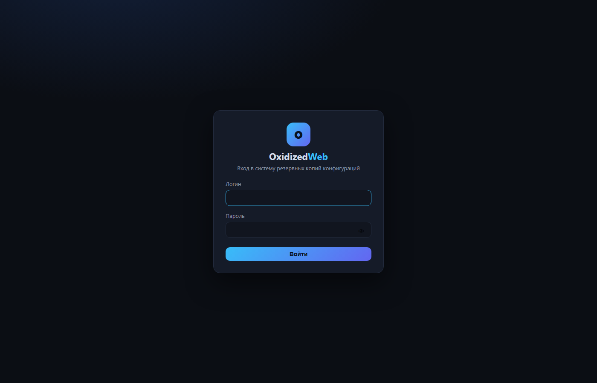
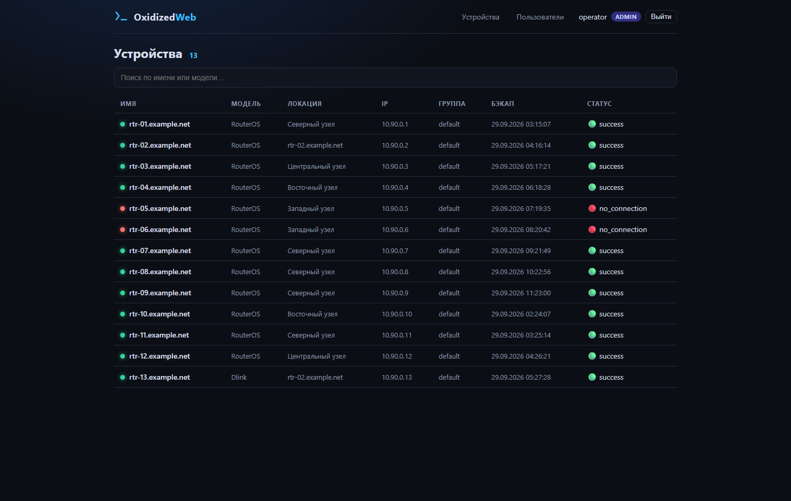
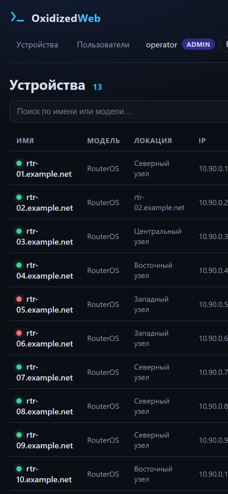
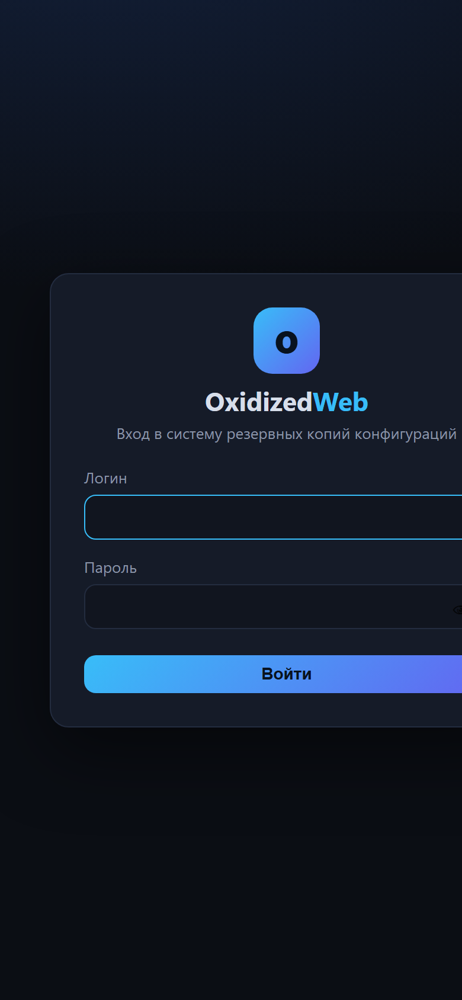

# OxidizedWeb

Веб-интерфейс к [Oxidized](https://github.com/ytti/oxidized) — системе резервного
копирования конфигураций сетевого оборудования.

## Что такое Oxidized

Oxidized — демон, который:

- обходит сетевые устройства по SSH/Telnet и забирает их конфигурации;
- хранит конфиги в git: каждый узел — отдельный файл, каждое изменение — коммит
  с возможностью откатиться на любую версию;
- отдаёт список устройств и конфигурации по REST API.

`oxidized-web` добавляет к этому браузерный интерфейс: список устройств, просмотр
и сравнение версий конфигураций, пользователей с ролями и API-токены.

## Скриншоты

Вход:



Список устройств:



## Интерфейс с телефона

Проверять, что с конфигурациями всё в порядке, часто удобнее не из кабинета, а с
телефона — в дороге, на обходе или прямо от стойки. Отдельной мобильной версии у
OxidizedWeb нет: это **тот же самый интерфейс**, который просто подстраивается под
ширину экрана. Всё, что есть на десктопе — список устройств, текущая конфигурация,
история версий и сравнение — доступно и на телефоне.

<p align="center">
  
  &nbsp;&nbsp;
  
</p>

Чтобы пользоваться с телефона, достаточно открыть адрес панели в браузере и добавить
страницу на домашний экран — устанавливать ничего не нужно. Для Android есть готовый
APK — тонкая обёртка того же веб-интерфейса:
[`apk/OxidizedMobile-v1.3.apk`](apk/OxidizedMobile-v1.3.apk). Исходников мобильной
части в этом репозитории не хранятся, залит только артефакт.

## Возможности

- Список узлов: имя, модель, группа, IP, время последнего бэкапа, статус.
- Просмотр текущей конфигурации узла — `/config`.
- История версий и сравнение (diff) любых двух версий — `/versions`, `/diff`.
- Пользователи с ролями `admin` / `user`; для `user` можно ограничить видимые устройства.
- API-токены (Bearer) для автоматизации и внешних интеграций.
- Первичная настройка через мастер `/setup`.
- Безопасность: пароли `bcrypt`, CSRF-токены, блокировка после 5 неудачных попыток
  входа на 15 минут.

## Требования

- **Oxidized** запущен и отвечает по REST API (по умолчанию `http://127.0.0.1:8888`):
  ```bash
  curl -s -o /dev/null -w '%{http_code}\n' http://127.0.0.1:8888/nodes   # ожидаем 200
  ```
- **nginx** и **PHP-FPM 8.5+** с расширениями `pdo_mysql`, `sqlite3`, `curl`, `mbstring`.
- **База данных с инвентарём устройств** (имён и локаций) — по умолчанию LibreNMS,
  база `librenms`, таблицы `devices` и `locations`.

`PHP_VER` в командах ниже — ваша версия PHP (`ls /etc/php/`), например `8.5`.

## Установка

### 1. Скопировать приложение

```bash
sudo mkdir -p /opt/oxidized-web/data/sessions
sudo cp -r public src /opt/oxidized-web/
sudo cp config.example.php /opt/oxidized-web/config.php
sudo chown -R www-data:www-data /opt/oxidized-web
sudo chown root:www-data /opt/oxidized-web/config.php
sudo chmod 640 /opt/oxidized-web/config.php
```

### 2. Учётка БД только на чтение

```bash
DB_PASS="$(openssl rand -base64 18)"
sudo mysql -e "CREATE USER IF NOT EXISTS 'oxidized_web'@'127.0.0.1' IDENTIFIED BY '${DB_PASS}';
                CREATE USER IF NOT EXISTS 'oxidized_web'@'localhost'  IDENTIFIED BY '${DB_PASS}';
                GRANT SELECT ON librenms.devices   TO 'oxidized_web'@'127.0.0.1';
                GRANT SELECT ON librenms.devices   TO 'oxidized_web'@'localhost';
                GRANT SELECT ON librenms.locations TO 'oxidized_web'@'127.0.0.1';
                GRANT SELECT ON librenms.locations TO 'oxidized_web'@'localhost';
                FLUSH PRIVILEGES;"
echo "пароль БД: ${DB_PASS}"   # он же пойдёт в OX_LX_PASS на шаге 3
```

### 3. Заполнить `config.php`

```php
<?php
declare(strict_types=1);
const OX_LX_HOST = '127.0.0.1';
const OX_LX_DB   = 'librenms';
const OX_LX_USER = 'oxidized_web';
const OX_LX_PASS = '<ПАРОЛЬ из шага 2>';
```

### 4. Пул php-fpm

`/etc/php/${PHP_VER}/fpm/pool.d/oxidized.conf`:

```ini
[oxidized]
user = www-data
group = www-data
listen = /run/php-fpm-oxidized.sock
listen.owner = www-data
listen.group = www-data
listen.mode = 0660
pm = dynamic
pm.max_children = 6
pm.start_servers = 2
pm.min_spare_servers = 1
pm.max_spare_servers = 3
security.limit_extensions = .php
php_admin_value[open_basedir]            = /opt/oxidized-web/:/tmp/
php_admin_value[session.save_path]       = /opt/oxidized-web/data/sessions
php_admin_value[session.use_strict_mode] = 1
php_admin_value[upload_max_filesize]     = 4M
php_admin_value[post_max_size]           = 4M
```

### 5. Виртуальный хост nginx

```bash
sudo cp deploy/templates/nginx-oxidized-web.conf /etc/nginx/conf.d/oxidized-web.conf
# подставьте свой адрес вместо 10.0.0.10
sudo sed -i "s|listen <SERVER_IP>:8889;|listen 10.0.0.10:8889;|" /etc/nginx/conf.d/oxidized-web.conf
sudo nginx -t && sudo systemctl reload nginx
```

### 6. Запуск и первый администратор

```bash
sudo systemctl restart "php${PHP_VER}-fpm"
```

Откройте `http://<ВАШ_IP>:8889` — сработает мастер **«Создайте первого
администратора»**. Готово.

## Как это работает

oxidized-web ничего не опрашивает по SSH — работа с устройствами целиком на Oxidized.
Приложение использует его REST API:

| Запрос | Что даёт |
|---|---|
| `GET /nodes.json` | список узлов: имя, модель, группа, статус, IP, время бэкапа |
| `GET /node/fetch/<имя>` | текущая конфигурация узла |
| `GET /node/version.json?node_full=<имя>` | история версий |
| `GET /node/version/view?node=<имя>&oid=<oid>` | содержимое конкретной версии |

Diff между версиями считается локально. Имена и локации устройств берутся из базы
данных (шаг 2) и подставляются в таблицу; при недоступной БД приложение не падает —
подставляет `-`.

## Где что лежит

| Путь | Что это |
|---|---|
| `/opt/oxidized-web/public` | код фронтенда (front-controller `index.php`) |
| `/opt/oxidized-web/src` | ядро: работа с БД, авторизация, клиент Oxidized REST |
| `/opt/oxidized-web/config.php` | параметры подключения к БД (в `.gitignore`) |
| `/opt/oxidized-web/data/oxidized.db` | SQLite: пользователи, привязки к устройствам, API-токены |
| `/etc/nginx/conf.d/oxidized-web.conf` | виртуальный хост |
| `/etc/php/<ver>/fpm/pool.d/oxidized.conf` | пул php-fpm |
| `/etc/oxidized/config` | конфигурация самого Oxidized |
| `/home/oxidized/configs` | git-репозиторий с сохранёнными конфигами |

## Полезные команды

```bash
sudo systemctl restart oxidized        # перезапустить Oxidized после правки конфига
sudo journalctl -u oxidized -f         # журнал Oxidized
sudo systemctl restart php8.5-fpm      # перезапустить пул oxidized-web
sudo tail -f /var/log/nginx/oxidized-web.error.log
git -C /home/oxidized/configs log      # история изменений конфигураций
```

## Мобильное приложение

См. раздел [«Интерфейс с телефона»](#интерфейс-с-телефона) и
[`apk/OxidizedMobile-v1.3.apk`](apk/OxidizedMobile-v1.3.apk).
